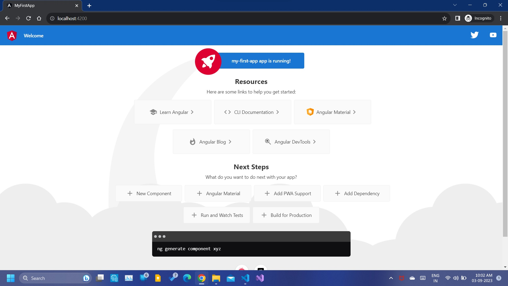

# LearningAngular

## Important Links

1. [Angular CLI](https://github.com/angular/angular-cli)
2. [Markdown basics](https://www.markdownguide.org/basic-syntax/)

## Node Installation Steps

1. Install nodeJs from [here](https://nodejs.org/en/download)
2. some nodeJs commands:
   - get node runtime version `node --version` or `node -v`
   - get node packet manager version `npm --version` or `npm -v`
   - update npm version globally `npm install -g npm@latest`
   - [popular commands](https://www.javatpoint.com/nodejs-command-line-options)

## Angular Installation Steps

1. Once nodeJs is installed, run the following command `npm install -g @angular/cli@latest` to install the latest version of angular CLI. Remember, `@latest` is optional. `-g` is for globally installing the angular cli.
2. Create a new project `ng new my-first-project`.

   - Should not contain whitespace, and the text test.
   - For learning purpose, we can use `ng new my-first-project --no-strict` in the _command prompt_.
   - Navigate into to the newly created project and run `ng serve`. the project will compile and run.
     > Angular Live Development Server is listening on localhost:4200, open your browser on <http://localhost:4200/>
   - 

3. To add bootstrap css to your project, you can install the bootstrap locally using `npm install --save bootstrap@3`. You must ensure that angular knows about this package. To achieve this, go to _angular.json_ file, Projects ->architect-> build->styles and add the reference to the bootstrap package. Make sure to insert the bootstrap reference before the src/styles.css (where the global styles are placed). Doing this will override the styles.css with the bootstrap css. Build your project.
   - To verify if the css file has got included, inspect the project and you will see the reference to bootstrap.min.css file in styles.css
